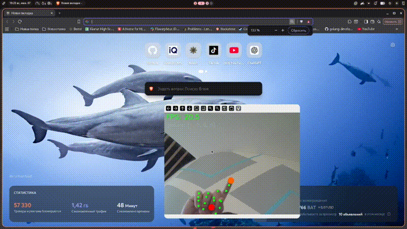

# Vision Mouse

Control your desktop with hand gestures via webcam.



## Gestures

| Fingers | Action |
|---|---|
| ☝️ index only | Move cursor |
| ☝️✌️ index + middle | Left click |
| 🖕 middle only | Right click |
| ☝️✌️🤟 three fingers | Swipe (switch desktops / task view) |
| 🤙 pinky only | Scroll up / down |
| 👍☝️ thumb + index | Zoom in / out |

Custom commands can be added through the web UI at `http://localhost:8000`.

## Stack

Python, OpenCV, MediaPipe, ydotool (Wayland) / pyautogui (Windows)
  
## Installation

### 1. Clone

```bash
git clone https://github.com/KotaNch/Vision-Mouse.git
cd Vision-Mouse
```

### 2. Download the hand tracking model

```bash
wget https://storage.googleapis.com/mediapipe-models/hand_landmarker/hand_landmarker/float16/latest/hand_landmarker.task
```

### 3. Dependencies

```bash
python -m venv venv
source venv/bin/activate
pip install -r requirements.txt
```

### 4. ydotool (Wayland only)

Arch / EndeavourOS:
```bash
sudo pacman -S ydotool
systemctl --user enable --now ydotoold
```

Other distros — check your package manager or build from source:
[https://github.com/ReimuNotMoe/ydotool](https://github.com/ReimuNotMoe/ydotool)

> Windows uses pyautogui instead, no extra setup needed.

### 5. Run

```bash
python main.py
```

Open `http://localhost:8000` to configure gestures and sensitivity.

## Contributing

Issues and PRs are welcome.